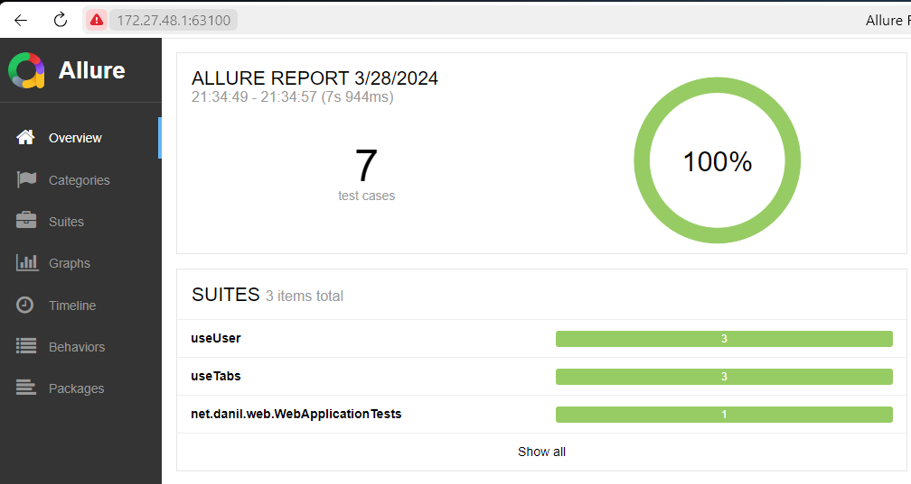

# Allure Report

В этой папке лежат скрипты для запуска аллюра.

## Как использовать

1. Запустите `npm test` в этой директории
    - Команда запускает тесты для фронтенда и web-сервиса
    - На фронте и на web-сервисе установлены плагины для генерации allure-results
    - Оба настроены складывать результаты в /allure-report/allure-results (папка в гит-игноре)
2. Запустите `npm start` в этой директории
    - Команда запускает `allure-commandline` для генерации страницы результатов
    - Браузер со страницей результатов откроется автоматически
   
Подробнее об обеих командах:
- [npm test](package.json#L7)
- [npm start](package.json#L8)

## Пример результата работы

Здесь одновременно отображаются тесты выполненные на фронтенде, и на web-сервисе.
