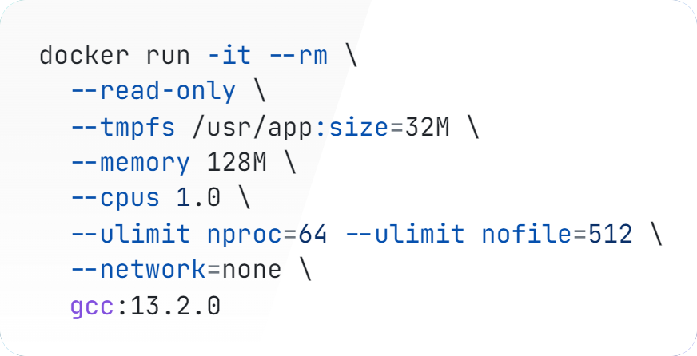

**Введение.**
Интерактивные образовательные системы обучения и проверки навыков предоставляют эффективный и увлекательный способ
развития навыков программирования. Такие платформы позволяют участникам получать мгновенную обратную связь и
анализировать свои ошибки, что ускоряет процесс обучения. Интерактивные платформы создают сообщества, где пользователи
могут обмениваться опытом, решать задачи и совершенствоваться вместе. Платформы могут предлагать задачи различных
уровней сложности и направлений, чтобы охватить широкий круг интересов и специализаций.
Решение алгоритмических задач развивает навыки, которые востребованы в профессиональной разработке и помогают в
подготовке к собеседованиям. Таким образом, разработка образовательных систем по программированию является актуальной.
Цель исследования - провести обзор источников по проектированию и разработке интерактивной информационной системы
обучения и проверки навыков программирования.

**Сравнение существующих аналогов.**
Существует множество информационных систем для обучения программированию с автоматизированной проверкой решений задач,
однако во время анализа существующих решений всегда можно выявить их недостатки. Именно они создают предпосылки для
разработки нового решения, которое будет более полно соответствовать потребностям пользователей.

**LeetCode**[1] — одна из самых популярных платформ для изучения алгоритмов и структур данных. Сильной стороной являются
удобный и красивый интерфейс, подходящий для начинающих, встроенный редактор кода с подсветкой синтаксиса и наличие
теоретических материалов. Сервис позволяет тестировать программы на своих входных данных, однако возможность создания
собственных задач не предоставляется. Это отличная платформа для изучения алгоритмов, но ее функционал сосредоточен
исключительно на этой области.
**CodeWars**[2] выделяется возможностью создавать свои задачи, что делает его особенно привлекательным для
пользователей,
которые ценят творческий подход и хотят делиться своими идеями с сообществом.
Несмотря на отсутствие теоретических материалов, платформа имеет красивый интерфейс и удобна для
новичков. Встроенный редактор кода с подсветкой синтаксиса дополняется системой тестирования программ через автотесты,
что является особенностью данной платформы среди рассматриваемых.
**Информатикс**[3] — русскоязычный сервис, но его устаревший и неудобный интерфейс снижает привлекательность. Код
приходится
писать и отлаживать локально, так как встроенного редактора нет, а решения загружаются в виде файлов. Навигация по
задачам усложнена, поиск осуществляется по идентификаторам. Теоретические материалы присутствуют в большом объеме.
Добавлять задачи на сайт могут только некоторые пользователи через специальную заявку, что ограничивает гибкость работы
с платформой. Собственные тестовые данные указать нельзя.
**HackerRank**[4] ориентирован на алгоритмические задачи и поддерживает добавление пользовательских задач, что
способствует
разнообразию контента.
Оценку решений можно кастомизировать указав скрипт на языках Python, Java и C++.
HackerRank не предоставляет теоретических материалов, фокусируясь исключительно на практике.
Платформа поддерживает огромное количество языков. HackerRank предоставляет сертификаты по различным навыкам,
которые можно добавить в профессиональное портфолио или профиль в LinkedIn.

**Методы проверки решений**
На платформах Информатикс и HackerRank проверка решений задач осуществляется на основе обработки
консольного ввода и вывода.
Пользовательская программа запускается с заранее подготовленными тестовыми входными данными, которые подаются на
ее консольный ввод. Программа выводит результат работы в консольный вывод.
Система тестирования сравнивает полученный вывод с эталонным.
Для проверки программы на других тестовых наборах данных осуществляется ее повторный запуск.

На платформе LeetCode проверка решений задач осуществляется на основе передачи тестовых данных в текстовом формате.
Входные данные десериализуются и преобразуются в аргументы для вызова пользовательской функции,
реализующей вычисления.
Оценка корректности выполняется путем сравнения возвращаемого функцией результата, с эталонным значением.
Такой подход исключает необходимость перезапуска программы, что
позволяет более точно измерять время выполнения алгоритма.

На платформе CodeWars проверка решений задач осуществляется с использованием автоматизированных тестов (автотестов).
Автор задачи пишет код, который выполняет проверку пользовательского решения на корректность.
Такой подход позволяет не только изучать алгоритмы и структуры данных,
где ключевым является получение правильных выходных данных для заданных входных,
но и осваивать концепции объектно-ориентированного программирования, включая проектирование классов,
реализацию методов с заданными сигнатурами, использование наследования, полиморфизма и других принципов ООП.
Корректность выполнения таких программ оценивается с помощью набора автотестов, проверяющих их поведение
в различных сценариях.

**Запуск недоверенного кода**.
Для проверки решений задач требуется запуск пользовательского кода,
а любой пользовательский код, отправляемый на платформу, является недоверенным и может являться вредоносным.
Недоверенный код нельзя выполнять на хост системе.
Для выполнения недоверенного кода применяют выполнение в песочнице или sandboxing.
Я изучил 2 статьи по тому, как применяется sandboxing в олимпиадах по информатике.
В статье "A New Contest Sandbox"[5] описывается вариант песочницы на linux control group и namespaces.
Те же механизмы используются в системе контейнеризации Docker, которую я использую в качестве песочницы.
В этой статье, а затем в следующей "Security of Grading Systems"[6] описывается безопасность системы оценки задач.
Я перенес требования из статей к системе контейнеризации Docker[7].
Если обобщить, то основным требованием является всяческое ограничение возможностей для недоверенного кода.

Docker по умолчанию создает изолированную файловую системы для каждого контейнера.
Если используется файловая система btrfs, overlay2, windowsfilter или zfs, то есть возможность ограничить размера через
параметр `--storage-opt size=120G`.
Другим вариантом ограничения размера является монтирование временной файловой системы tmpfs
с параметром `--tmpfs /usr/app:size=32M`.
Можно ограничить количество операций ввода-вывода с параметрами `--device-read-IOPS` и `--device-write-IOPS`.
Тем не менее, если файловая система расположена в оперативной памяти, то особого смысла для этого нет.
Дополнительно можно сделать файловую систему только на чтение с параметром `--read-only`.

Docker позволяет ограничить контейнер по ОЗУ и процессорному времени. Даже если задание по программированию не
предусматривает ограничение памяти или процессору, то все равно память и процессор нужно ограничить, чтобы не мешать
другим контейнерам и хостовым процессам. Делается это параметрами --memory 128M и --cpus 1.0.

Сетевое взаимодействие можно ограничить с параметром `--network=none`.
Чрезмерное число процессов в контейнере может создать перегрузку для планировщика задач.
Рекомендуется ограничить число процессов, запускаемых в контейнере с параметром `--ulimit nproc=64`
и файловых дескрипторов с параметром `--ulimit nofile=512`.
На рисунке 1 представлена команда запуска контейнера с недоверенным кодом.



```shell
docker run -it --rm \
  --read-only \
  --tmpfs /usr/app:size=32M \
  --memory 128M \
  --cpus 1.0 \
  --ulimit nproc=64 --ulimit nofile=512 \
  --network=none \
  gcc:13.2.0
```

**Совместное редактирование кода**. На платформе планируется реализовать функционал совместного редактирования кода.
Это позволяет изучать программирование или проверять навыки программирования совместно с кем-либо.
Требуется синхронизировать в реальном времени содержимое редактора кода, положение курсоров, выделенные области текста.
В качестве редактора кода можно выбрать Monaco Editor или CodeMirror.
Синхронизировать состояние можно с помощью CRDT(Conflict-free replicated data type)[8] или OT(operational
transformation).
Как протокол обмена данных можно выбрать между WebRTC и WebSocket.
WebRTC предлагает организацию прямого соединения между браузерами пользователей для минимизации задержек и нагрузки на
сервер.
Использование WebSockets возможно более простой путь, через применение центрального сервера для обмена данными.
Для реализации данного функционала можно применить библиотеку Yjs, в которой уже реализованы типы CRDT.
У Yjs есть интеграции с протоколами WebRTC, WebSocket и редакторами кода Monaco Editor, CodeMirror.

**Заключение.** Были рассмотрены существующие образовательные платформы. Изучены их методы проверки решений задач.
Проанализированы материалы по безопасному запуску недоверенного кода и применены к системе контейнеризации Docker.
Выявлены возможности по реализации совместного редактирования кода.
Обзор источников позволяет перейти к следующему этапу - проектированию интерактивной образовательной системы.

**Библиографический список.**

1. Платформа LeetCode. URL: https://leetcode.com/ (дата обращения: 21.01.2025).
2. Платформа CodeWars. URL: https://www.codewars.com/ (дата обращения: 21.01.2025).
3. Платформа Информатикс. URL: https://informatics.msk.ru/ (дата обращения: 21.01.2025).
4. Платформа HackerRank. URL: https://www.hackerrank.com/ (дата обращения: 21.01.2025).
5. Mareš, M. Blackham, B. (2012). A New Contest Sandbox. Olympiads in Informatics, 6, 100–109.
6. Mareš, M. (2021). Security of Grading Systems. Olympiads in Informatics, 15, 37–52.
7. Система контейнеризации Docker. URL: https://docs.docker.com/engine (дата обращения: 21.01.2025).
8. Бесконфликтные реплицированные типы данных CRDT.
   URL: https://en.wikipedia.org/wiki/Conflict-free_replicated_data_type (дата обращения: 21.01.2025).